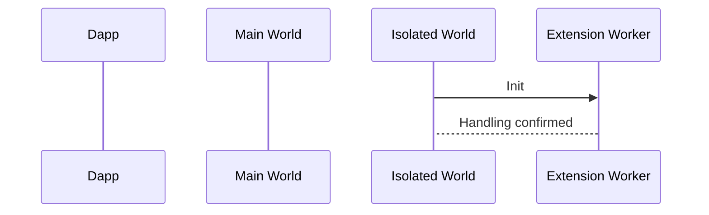
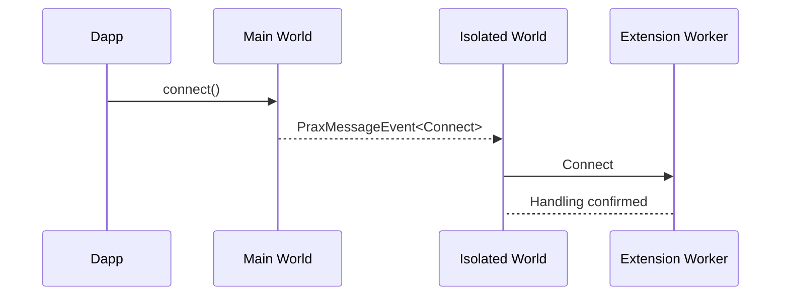
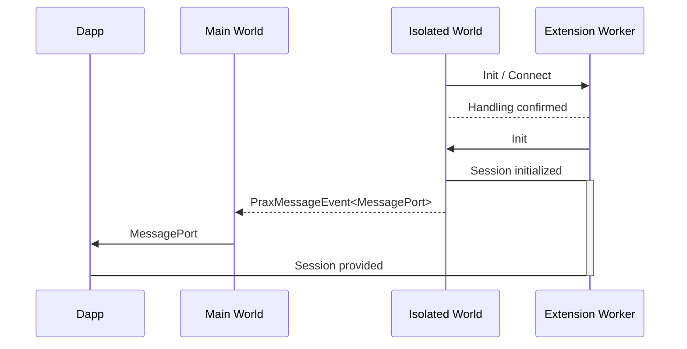

# Content Script Messaging

Content scripts are used to establish communication between dapps and the Prax provider.

Chrome's [execution worlds](https://developer.chrome.com/docs/extensions/reference/api/scripting#type-ExecutionWorld) provide two contexts with different roles and abilities:

1. **Main World** (`injected-penumbra-global.js`) interacts freely with dapp scripts. This injection exposes the Penumbra provider API as a global. It has no access to extension APIs.

2. **Isolated World** (`injected-session.js`) acts as a bridge between the injected provider and Prax. It has limited access to both the dapp content and the extension worker.

Communication between Main World and Isolated World uses the standard DOM API `window.postMessage`, using `PraxMessageEvent<PraxConnection>` values identifying Prax by its extension id.

The Isolated World and Extension Worker communicate using Chrome's extension messaging API. Messages here are bare `PraxConnection` values.

## Concerns

The content scripts must:

- Ignore DOM messages without the expected format `PraxMessageEvent`.
- Ignore DOM messages from other documents.

## Example Case

When any document is loaded, the Isolated World content script announces itself to the extension worker:

If the extension worker is already aware of the document's origin, it can instruct the content script to reveal a 'connected' state to the page without waiting for dapp interaction.

When a dapp wants to connect to Prax, it calls `connect` on the Main World provider. Then,

- The Main World content script sends a `PraxMessageEvent<Connect>` to the Isolated World content script using `window.postMessage`
- The Isolated World content script sends a bare `PraxConnection` message to the Extension Worker using `chrome.runtime.sendMessage`

The extension worker performs its own sender validation at this point. It may create an approval dialog for the user to render a decision, which uses its own distinct message flow.

Actual session initialization is a separate sequence, which may be triggered by the above `Connect` request, or the above `Init` request.

Other messages follow similar patterns.

## See Also

- [Messaging Architecture Overview](./architecture.md)
- [Internal Messaging](./internal-control.md)
- [Extension Services](../extension-services.md)
- [Chrome Extension Message Passing](https://developer.chrome.com/docs/extensions/mv3/messaging/)
- [Content Scripts Execution Worlds](https://developer.chrome.com/docs/extensions/reference/api/scripting#type-ExecutionWorld)
