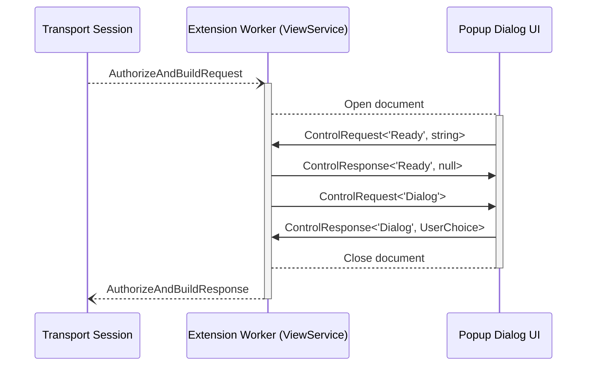

# Internal Control Messaging

Internal messaging is used between:

- Extension worker <-> Popup UI
- Options UI -> Extension worker

A typed request/response pattern is specified in [`message/control.ts`](../apps/extension/src/message/control.ts):

```typescript
type ControlRequest<M extends ControlTypeName, D> = Record<M, D> & { id?: string };
type ControlResponse<M extends ControlTypeName, D> = Record<M, D>;
```

The exported types and type guards provide:

- Guidance for listener and handler implementation
- Consistent and identifiable message structure
- Document addressing by ID

## Core Utilities

The [`listenInternal`](../apps/extension/src/internal-listener.ts) and [`sendInternal`](../apps/extension/src/message/send/internal.ts) utilities wrap Chrome's messaging API with:

1. **Structure Validation**: Ignores messages not following the expected structure
2. **Sender Validation**: Ignores messages not from the expected senders
3. **Message Filtering**: Optionally, ignores messages without a specific ID or custom criteria
4. **Error Propagation**: Serializes and reports handler failures back to the sender

## Example Case

The [popup utility](../apps/extension/src/popup.ts) uses `listenInternal` to identify popup document readiness, and `sendInternal` to address dialog control messages to the specific popup document that should handle them:

```typescript
// excerpt `popup` function
const id = await spawnDialog(parent, dialogType);
```

```typescript
// excerpt `spawnDialog` function
const listener = listenInternal(
  'Ready',
  Ready => {
    resolve(Ready);
    return null;
  },
  // Only handle if the message data matches the creation ID
  ({ Ready }) => Ready === id,
);
```

```typescript
// excerpt `popup` function
const dialogResponse = await sendInternal('Dialog', dialogRequest, id);
```



## Other Use

### Extension Worker Handlers

The extension worker ([`service-worker.ts`](../apps/extension/src/service-worker.ts)) registers listeners for:

- **`BlockProcessor`** commands to manage local chain state
- **`Revoke`** requests to remove dapp permissions

### Dialog Components

The [`useDialogInit`](../apps/extension/src/hooks/dialog-init.ts) hook enables components to:

- Signal readiness to the extension worker
- Receive and process targeted dialog requests

## See Also

- [Content Script Messaging](./content-script.md)
- [Extension Services](../extension-services.md)
- [State Management](../state-management.md)
- [Chrome Extension Messaging](https://developer.chrome.com/docs/extensions/mv3/messaging/)
